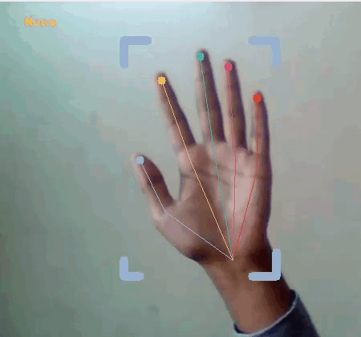

# Gesture-Control-Mediaplayer-V1

[](https://www.python.org/downloads/release/python-390/) 
[](https://google.github.io/mediapipe/) 




# How to use it?

> Change CHOICE to 'youtube' or 'vlc'    
> Change WEB_CAM_SOURCE to your webcam Source

> ```
> from HAND_GESTURE_MEDIAPLAYER_CONTROLER import YT_VLC_CONTROL_HAND_TRACKING
> 
> if __name__ == "__main__":
>     controler = YT_VLC_CONTROLL_HAND_TRACKING(CHOICE='youtube', WEB_CAM_SOURCE=0)
>     controler.start()
> ```

# Demo 
 Youtube video - https://youtu.be/aR4TvTsH3vs

# Sources
> [Mediapipe](https://google.github.io/mediapipe/solutions/hands.html)
